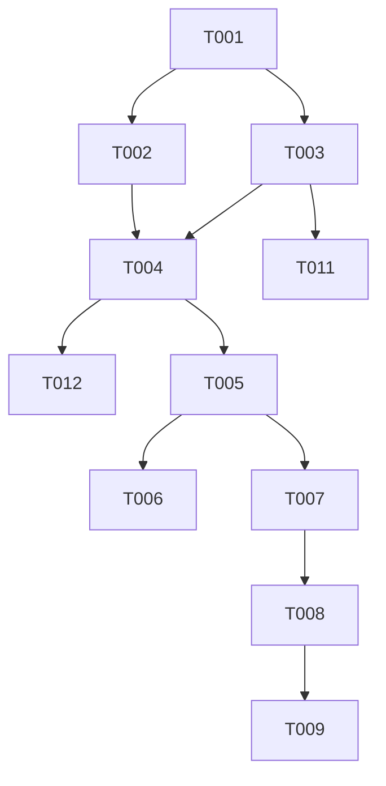

# Tasks: Add Buildings

**Feature**: Add Buildings
**Status**: In Progress
**Branch**: `002-add-buildings`

## Phase 1: Setup
*Project initialization and type definitions.*

- [x] T001 Define `BuildingFeature` and `BuildingMesh` interfaces in `src/types/index.ts`

## Phase 2: Foundational
*Blocking prerequisites for all user stories.*

- [x] T002 [P] Update `src/services/tileService.ts` to ensure `building` layer is fetched
- [x] T003 [P] Implement `parseBuildings` function in `src/utils/tileParser.ts`
- [x] T004 Implement `createBuildingGeometries` with grid lookup in `src/utils/geometryGenerator.ts`

## Phase 2b: Verification
*Unit testing core logic as per Constitution Principle III.*

- [x] T011 Create/Update `src/utils/tileParser.test.ts` to verify building parsing
- [x] T012 Create/Update `src/utils/geometryGenerator.test.ts` to verify height/position logic

## Phase 3: User Story 1 - View 3D Buildings
*As a user, I want to see 3D buildings displayed on the terrain map.*

**Goal**: Buildings appear on the 3D map, correctly positioned on the terrain.
**Independent Test**: Select an area (e.g., city center), generate model, verify buildings appear.

- [x] T005 [US1] Update `src/components/Scene3D.tsx` to generate and add buildings to the scene

## Phase 4: User Story 2 - Include Buildings in STL Export
*As a user, I want the buildings to be included in the downloaded STL file.*

**Goal**: STL export contains both terrain and buildings as a printable object.
**Independent Test**: Download STL, open in slicer, verify buildings are present and solid.

- [x] T006 [US2] Update export handler in `src/components/Scene3D.tsx` to include buildings group in export

## Phase 5: User Story 3 - Toggle Buildings
*As a user, I want to be able to turn building display on or off.*

**Goal**: User can toggle building visibility/generation.
**Independent Test**: Toggle checkbox, verify buildings appear/disappear.

- [x] T007 [US3] Add `showBuildings` state and handler in `src/App.tsx`
- [x] T008 [US3] Add "Show Buildings" checkbox to `src/components/MapSelector.tsx`
- [x] T009 [US3] Pass `showBuildings` prop to `Scene3D` and conditionally render in `src/components/Scene3D.tsx`

## Phase 6: Polish & Cross-Cutting
*Refinements and optimizations.*

- [x] T010 Tune basement depth and intersection logic in `src/utils/geometryGenerator.ts`

## Dependencies

## Parallel Execution Examples

- **Data Layer**: T002 (Service) and T003 (Parser) can be implemented in parallel after T001.
- **UI**: T007/T008 (Toggle UI) can be implemented while T004/T005 (3D Logic) is being worked on, though integration (T009) requires both.

## Implementation Strategy

1.  **MVP (US1)**: Focus on getting buildings to show up first. This validates the core technical challenge (placing 3D objects on generated terrain).
2.  **Export (US2)**: Once visible, ensuring they export is usually a minor adjustment to what is passed to the exporter.
3.  **Control (US3)**: Adding the toggle is a standard React state lift.
